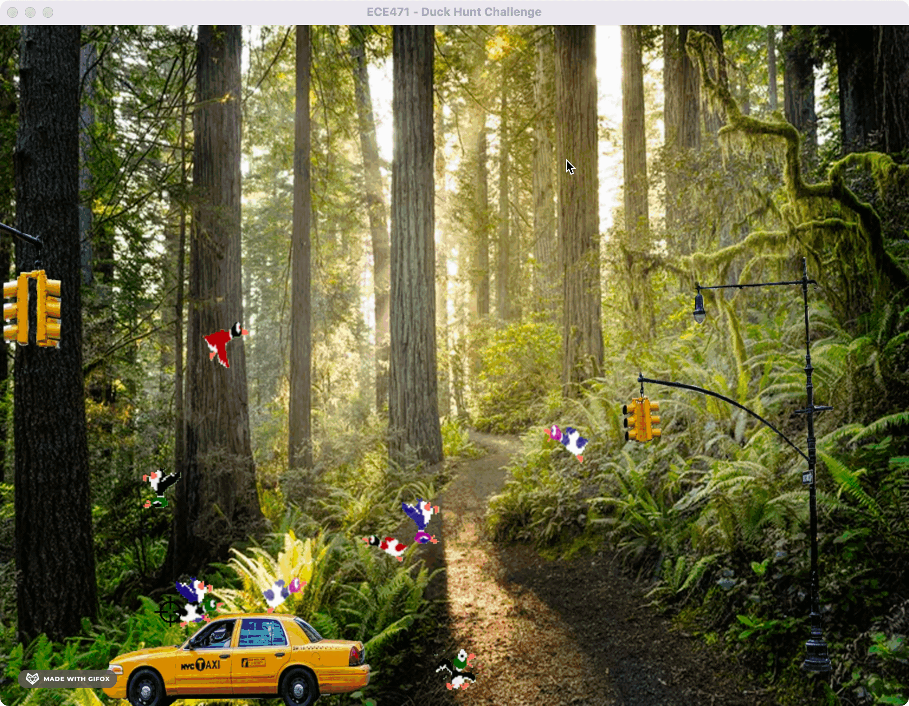
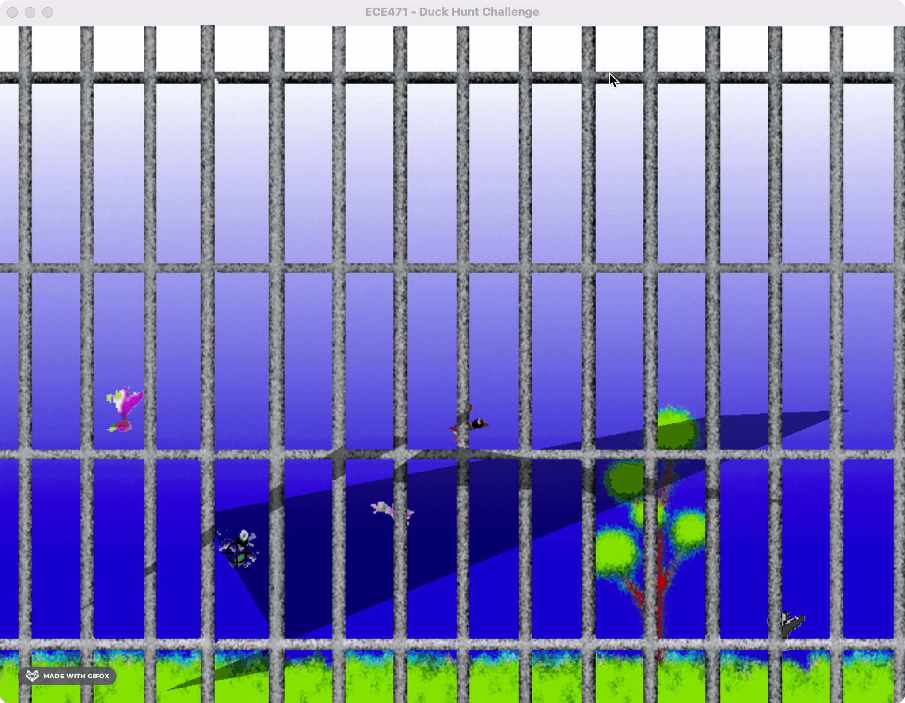

# Duck Hunt Challenge
This repository provides a solution for the game, Duck Hunt, via an AI to act as an "aim bot". The solution uses fine-tuning of SSD-MobileNet and SSD-Resnet50 with our a custom dataset of ducks and dead ducks across various levels. 
 
Note - our code is in solution.py and in two Python packages called model and utils. Also the fine-tuned
models (resnet and mobilenet) are in trained_models, the model training occured in duck_hunt_training.ipynb on Google Colab 
## Setup
1. `./setup_venv.sh venv` or `python3.7 -m pip install -r requirements.txt`
2. Ensure ece471_duckhunt package is installed -> we had ours running on MacOS: `ece471_duckhunt-1.2.0-py3-none-any.whl`
3. Activate the virtual environment: `source venv/bin/activate`
3. Run the game thru `./run_levels.sh` or `python duck_hunt_main.py -m "absolute" -l $x -d $duration` 

## Demonstration - Transfer Learning of SSD MobileNet
### Note - Multiple ducks can be shot at once, cross hair may only move to one or not at all in each frame
#### Level 100

 
 

#### Level 700

 
 

#### Level 800

## Dataset
https://drive.google.com/drive/folders/17RMRdD8wjiRORFZ305xa9aumtHna3WlT?usp=sharing

## References

Martín Abadi, Ashish Agarwal, Paul Barham, Eugene Brevdo,
Zhifeng Chen, Craig Citro, Greg S. Corrado, Andy Davis,
Jeffrey Dean, Matthieu Devin, Sanjay Ghemawat, Ian Goodfellow,
Andrew Harp, Geoffrey Irving, Michael Isard, Rafal Jozefowicz, Yangqing Jia,
Lukasz Kaiser, Manjunath Kudlur, Josh Levenberg, Dan Mané, Mike Schuster,
Rajat Monga, Sherry Moore, Derek Murray, Chris Olah, Jonathon Shlens,
Benoit Steiner, Ilya Sutskever, Kunal Talwar, Paul Tucker,
Vincent Vanhoucke, Vijay Vasudevan, Fernanda Viégas,
Oriol Vinyals, Pete Warden, Martin Wattenberg, Martin Wicke,
Yuan Yu, and Xiaoqiang Zheng.
TensorFlow: Large-scale machine learning on heterogeneous systems,
2015. Software available from tensorflow.org.

